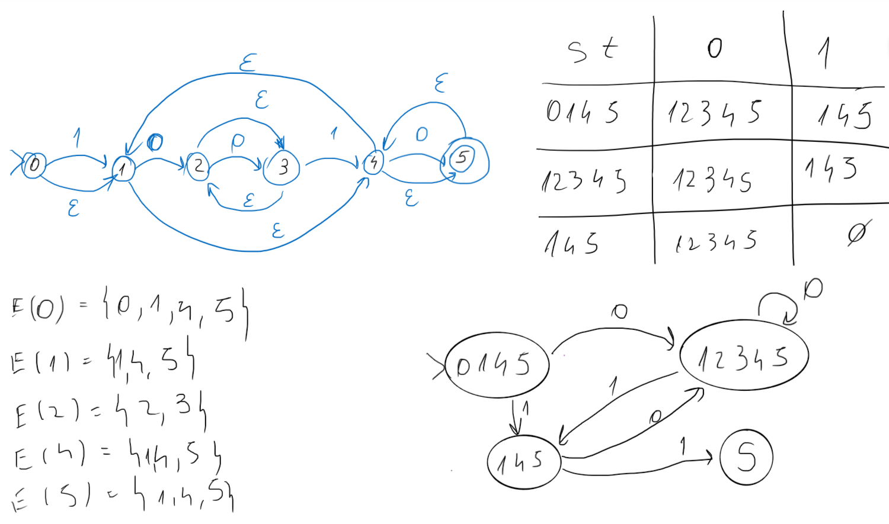

# epsilon-NFA-to-DFA
Homework for Formal Languages and Automata subject. We had to implement the subset construction algorithm to convert an epsilon NFA to a DFA.

# Romanian readme

## Introducere
Pentru realizarea temei m-am folosit de laboratorul 2, în care am avut de făcut 
o clasă pentru un DFA. Am schimbat puțin citirea și am modelat clasa pentru NFA.
Modelul pentru codificarea stărilor este un dicționar cu cheia de forma unui
tuplu (stare, simbol):

| Formal | Cod |
| ------------------------------------------ | ------------------------------------------ |
| $\delta [stare][simbol] = \{S_{1}, S_{2}, \dots, S_{n}\}$ | `delta[(stare, sym)] = [stare]` | 

## I / O
Pentru citire, am făcut un one-liner în stil funcțional (just for fun) care îmi
returnează (într-o listă mare) o listă cu fiecare linie *split by* spațiu. Clasa
de NFA prelucrează fix input-ul ăsta, își scoate din listă ce trebuie.

Pentru scriere, am redenumit toate stările crescător, ca în fișierele *ref*.
Pentru redenumire, când descopăr o stare a DFA-ului, o pun într-un dicționar,
numit `statesRename`, de forma `statesRename[stare_veche] = index`, unde index
este un counter global.

La final, în funcția `finalTouches`, completez numărul de stări, stările finale
și redenumesc stările cu ajutorul unui dicționar auxiliar din clasă (`newTrans`).

## Subset Construction
Algoritmul propriu zis este funcția `constructDFA`, care spune, în limbaj 
natural:

~~~
Începem cu E(0). Îl adăugăm în coadă și în set.
    
Cât timp coada nu este vidă (mai avem stări de prelucrat):
        
    Scoatem o stare din coadă.
        
    Pentru fiecare simbol din alfabet:
            
        Căutăm toate stările în care poți ajunge din starea curentă cu
        simbolul curent și le punem într-un set, care simbolizează starea din DFA.

        Verificăm în set-ul cu stările deja găsite (dfaStates) dacă am mai găsit
        starea asta sau nu.
            
            Dacă nu am mai găsit-o, o punem în coadă pentru a o prelucra și în
            set pentru a ține-o minte.
~~~

### Epsilon Closure
Pentru a vedea toate stările în care poți ajunge pe $\varepsilon$ dintr-o stare
dată, calculăm epsilon closure. Am făcut asta în funcția `getEpsilonClosure`,
care funcționează asemănător cu algoritmul de Subset Construction (din punct de
vedere al structurii codului).

Folosește o coadă pentru stările în curs de explorare și un set pentru a ține
minte ce a explorat deja. Poate fi asemănat cu o parcurgere de grafuri 
(DFS/BFS), arcele fiind tranzițiile pe $\varepsilon$ și nodurile chiar stările.
Funcția returnează un set.

#### Epsilon Transitions
`getEpsilonTrans` este o funcție ajutătoare pentru `getEpsilonClosure`, care îmi
întoarce tranzițiile pe $\varepsilon$ dintr-o anumită stare. Am declarat-o
pentru a mă ajută să fac list comprehension frumos și elegant.

### Get DFA State
`getDfaState` este altă funcție ajutătoare pentru `constructDFA`, care îmi 
returnează un set cu toate stările în care pot ajunge din starea dată, pe 
simbolul dat.

### Exemplu

Luând ca exemplu exercițiul 10 din laboratorul 4:

&nbsp;
\
&nbsp;

Funcția `getEpsilonClosure` calculează toate $E(S_{n})$.

Funcția `getDfaState` returnează o celulă de pe coloana 2 sau 3 (adică îi dăm
starea și simbolul și calculează starea rezultat).

Funcția `constructDFA` calculează tot tabelul.

## Alte detalii de implementare
- Am folosit câteva variabile globale pentru a mă ajuta să țin codul curat și
organizat.
    1. `epsilon`: Memorează toate închiderile epsilon. Ex: E\[0] este închiderea
    epsilon a stării 0.
    2. `alphabet`: Când citesc NFA-ul, pun într-un set toate simbolurile citite.
    Pentru că set-ul nu are duplicate, rămân cu $\Sigma$.
    3. `statesRename` și `stateIndex`: Am detaliat la început strategia mea
    de redenumire a stărilor.
- Funcțiile `addState` și `createNFA` sunt doar un moft, nu au un scop în afară
de a face codul mai aerisit.
